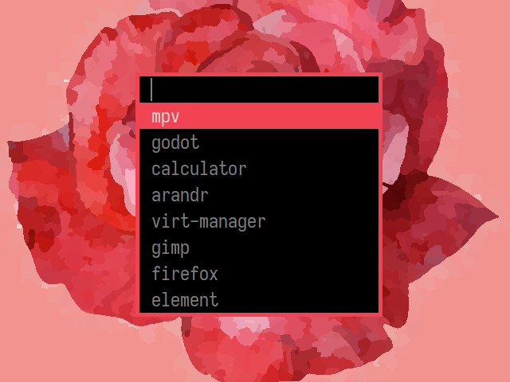

# dmenu - kota's fork
dmenu is an efficient dynamic menu for X.
This is my personal fork with a few useful patches.



## Patches
### custom centering
The standard center patch on suckless.org is extremely slow when reading large
files because it reads all items, then loops through to determine the string
length before displaying a window. This patch implements centering, but does
not calculate a width automatically. Instead you may manually pass in a width
using the new `-z` flag.

### border
Allows setting a window border. Helps make the window standout a bit. Size can
be configured in config.h

### fuzzymatch
This patch adds support for fuzzy-matching to dmenu, allowing users to type
non-consecutive portions of the string to be matched. It can be turned off
with the `-F` flag.

### dmenu_dprint script
I've added a new helper script for use with my `dprint` tool. My
[dprint](https://git.sr.ht/~kota/dprint) program is a replacement for the
standard "listing your entire $PATH" approach to launching programs. Instead it
prints from .desktop files allowing you to customize the names of entries
seperate from the command they run. Additionally, it creates a cache and lists
programs by how often you run them by default.

### xresources
I added the xresources patch. You can now configure font and colors with
xresources without needing to recompile. These are the options you may put in
your `~/.Xresources` remember to run `xrdb ~/.Xresource` after changing it:
```
dmenu.font : font or font set
dmenu.background : normal background color
dmenu.foreground : normal foreground color
dmenu.selbackground : selected background color
dmenu.selforeground : selected foreground color
```

## Requirements
In order to build dmenu you need the Xlib header files.

`doas apk add libx11-dev libxinerama-dev libxft-dev`

## Installation
Edit `config.mk` to match your local setup (dmenu is installed into
the `/usr/local` namespace by default).

Afterwards enter the following command to build and install dmenu
(if necessary as root):

`make clean install`

## Running dmenu
See the man page for details.
